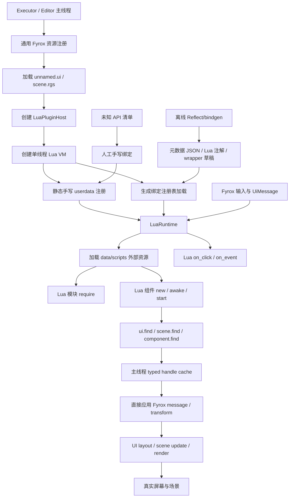
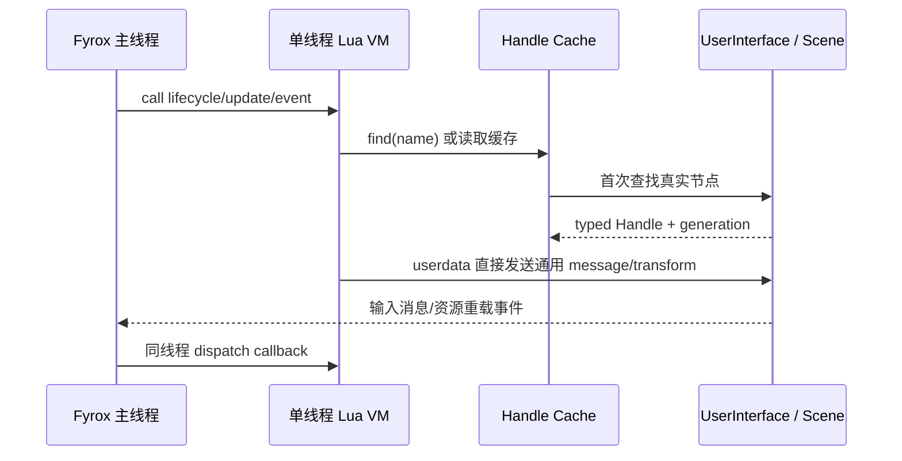
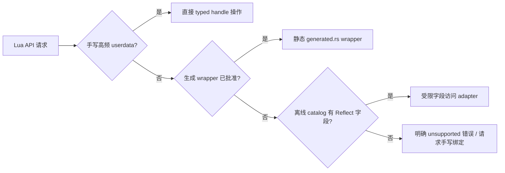
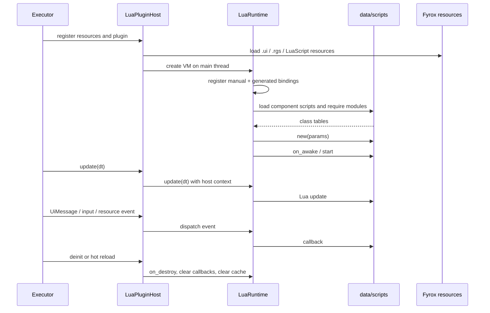

# Lua 单线程插件化绑定实施方案

## 1. 文档目的

本文是后续重构的实施设计，不是本轮代码修改记录。本轮只定义目标架构、迁移步骤、验收标准和性能指标，暂不修改 Rust、Lua 或 Fyrox 资源文件。

目标是把两个方案合并为一套可持续的 Fyrox Lua 运行时：

- 采用 FWOK 的资源优先、真实资源查找、集中生命周期和热重载边界。
- 采用 Fyrox-Lua 的元数据提取方向，把 `Reflect/bindgen` 改造成**离线生成工具**。
- 对稳定高频 API 使用少量手写 userdata；对未知或无法自动生成的类型保留手写绑定。
- 假设 Fyrox-Lua 的 Lua 插件模型可运行，但不采用其 Lua 脚本反射运行时设计。
- Lua VM 只在主线程运行，删除 `Arc`、`Mutex`、`Send + Sync` 桥接和跨线程共享状态。
- 移除 `game` 库中的游戏业务、UI 业务和测试玩法；所有测试业务放到 `./data/scripts` 的 Lua 资源中。

## 2. 目标和非目标

### 2.1 目标

1. 单个主线程 Lua VM，所有 Lua 调用、userdata、资源句柄和命令应用都在同一线程完成。
2. 绑定注册快速、可审计、可生成、可测试。
3. 高频路径使用稳定 typed handle 和手写 userdata，避免每次调用动态反射。
4. `Reflect/bindgen` 只负责离线发现类型、字段、方法签名、文档和生成候选代码。
5. 未知 API、复杂 trait、异步资源和特殊生命周期由人工批准后手写绑定。
6. UI、场景节点、组件和 Lua 脚本均先存在于 `.ui`、`.rgs`、prefab 或外部 `data/scripts` 资源，Lua 只查找和操作。
7. `game` 只作为 Fyrox 插件宿主和通用资源注册入口，不含搬箱子、聊天、按钮名称、Player/Box 业务状态。
8. 真实运行必须能验证 Lua 日志、真实 UI 节点、绘制命令、点击消息和场景对象变换。

### 2.2 非目标

- 不修改 Fyrox 引擎核心源码。
- 不在运行时对所有 Fyrox 类型做全量动态反射。
- 不把 `create_*` 作为普通业务 API；它只能保留在测试或明确授权的编辑器原型能力中。
- 不在 Rust 中恢复任何具体业务名称分支，例如 `inventory_button`、`send_button`、`BoxB`。
- 不用日志出现作为 UI 已接入的唯一证据。
- 不为了消除编译错误而把 VM、userdata 或句柄放进跨线程共享容器。

## 3. 总体架构



### 3.1 线程模型



约束：

- Lua VM 不实现 `Send`，不跨线程移动。
- 所有 `LuaRuntime`、Lua registry key、Lua callback、userdata proxy 和 `HandleToken` 只由主线程拥有。
- 不使用 `Arc<Mutex<T>>`、`MutexGuard`、跨线程 channel 或 `SendWrapper` 保存 Lua 状态。
- 若未来后台线程产生资源加载完成通知，后台只写 Fyrox 已有资源系统；主线程下一帧读取结果并调用 Lua。后台线程不得直接调用 Lua 或 userdata。
- Rust API trait 不再要求 `Send + Sync`；改成主线程约束，例如 `LuaHostApi`，并在构造时记录所属线程。

## 4. 模块职责重划分

### 4.1 `lua-plugin` 目标目录

| 模块 | 职责 | 禁止内容 |
|---|---|---|
| `runtime.rs` | 单线程 VM、脚本实例、生命周期、事件和热重载 | 业务名称分支、玩法状态 |
| `plugin.rs` | Lua 插件宿主、主线程初始化、场景/UI 上下文绑定 | 具体 UI/游戏逻辑 |
| `host_context.rs` | 当前帧 Fyrox 资源访问、UI/Scene registry、generation 校验 | `Arc/Mutex` 桥接 |
| `handles.rs` | UI/Scene/Component typed handle 和失效检查 | 名称特化逻辑 |
| `bindings/manual.rs` | 少量稳定、高频、未知 API 的手写 userdata | 业务回调实现 |
| `bindings/generated.rs` | 离线工具生成并审计过的静态 wrapper 注册 | 运行时反射扫描 |
| `bindings/catalog.rs` | 类型、方法、状态、来源和版本清单 | 把 CatalogOnly 当成可调用 API |
| `resource.rs` | `LuaScript` 资源、`LuaComponent`、外部 UUID 和参数 | 内嵌业务源代码默认路径 |
| `ui.rs` | 通用 `find`、缓存、Text/TextBox/Button message 和事件映射 | 创建业务节点 |
| `scene.rs` | 通用节点查找、transform、组件访问和 generation | Player/Box 等业务字段 |
| `reload.rs` | Lua 源文件、模块缓存、实例销毁和重建 | 资源替代/幽灵节点 |
| `offline-bindgen/` | 解析 rustdoc/Reflect、输出 JSON/注解/wrapper 草稿 | 运行时依赖 |

### 4.2 `game` 目标边界

`game` 只保留：

- Fyrox `Plugin` 实现和 `LuaPluginHost` 初始化。
- `register_fyrox_resources` 调用。
- 加载配置、UI 资源和场景资源。
- 把当前帧的通用 `PluginContext` 交给 `lua-plugin`。
- 转发通用输入、UI 消息、窗口事件和资源重载事件。
- 统一错误返回和启动/停止日志。

`game` 必须移除或迁移到 Lua 的内容：

- `GameState`、`InputState`、搬箱子碰撞/目标判定。
- Player、BoxA、BoxB 等具体节点字段和同步函数。
- `Bridge`、`BridgeHandle`、`Arc<Mutex>` UI/场景业务桥。
- `inventory_button`、`send_button`、`skill_button` 等业务名称判断。
- UI 文本、聊天、背包、技能和箱子轨道动画。
- `gameplay.rs` 中的业务单元测试；改为 `data/scripts/tests` Lua 测试脚本。
- `hub.rs` 中仅为示例玩法服务的消息类型和状态。

迁移完成后，`game/src/lib.rs` 不应再导入 `HashMap`、`Arc`、`Mutex`、`SceneCommand`、`UiCommand` 或具体业务状态类型。

### 4.3 Fyrox-Lua 文件的借鉴和排除

| Fyrox-Lua 文件/概念 | 目标处理 | 原因 |
|---|---|---|
| `game/src/plugin.rs` 的插件注册顺序 | 借鉴到 `lua-plugin/src/plugin.rs` | 保留“资源注册 -> VM -> 脚本发现 -> 生命周期”的主线程流程 |
| `game/src/lua_bindings.rs` | 拆成 `bindings/manual.rs` 和 generated 注册入口 | 只保留少量高频/特殊 userdata；不保留游戏业务 |
| `game/src/lua_reflect_bindings.rs` | 移到 `offline-bindgen` 的元数据/代码生成阶段 | Reflect 用来发现字段和签名，不作为 Lua 运行时全量动态反射 |
| `bindgen/src/expand_parser` | 重写为可失败、可审计的离线解析器 | 未知 AST 输出 unsupported，不允许 `todo!()` 进入运行时 |
| `game/src/node_based_expr.rs` | 不直接移植脚本反射表达式 | 当前项目统一使用 typed Handle + generation；避免脚本自有值的借用复杂度 |
| `game/src/script_object.rs` / `script_data.rs` | 不移植 `Packed/Unpacked` 脚本反射状态模型 | FWOK 的 `LuaRuntime` 已有清晰 registry key 和实例生命周期 |
| `game/src/script_def.rs` metadata 解析 | 只吸收 UUID/类/字段描述格式 | 解析结果进入 LuaScript 资源清单，不自动把所有模块注册成场景脚本 |
| `game/src/lua_utils.rs` 的生命周期辅助 | 仅按需要吸收错误格式化工具 | 不引入 TLS `ScriptContext` 和 `'static` 借用逃逸 |

因此，目标不是把 Fyrox-Lua 的脚本反射实现搬进 FWOK，而是把它的**元数据来源和插件初始化顺序**转化为可生成、可审计的静态绑定流程。

## 5. 单线程数据流设计

### 5.1 从 `Arc<Mutex<Bridge>>` 改为主线程借用上下文

当前模型：

```text
Lua userdata -> Arc<Mutex<Bridge>> -> game update lock -> command Vec -> UiRegistry/SceneGraph
```

目标模型：

```text
主线程 Lua callback
  -> HostContext 的短期可变借用
  -> typed Handle 校验
  -> 直接调用 UserInterface / SceneGraph 通用 API
  -> Fyrox message queue 或同帧安全 mutation
```

推荐接口形态：

```rust
pub struct LuaHostContext<'a> {
    pub user_interfaces: &'a mut UserInterfaces,
    pub scenes: &'a mut Scenes,
    pub input: &'a InputSnapshot,
    pub frame: u64,
}

pub trait LuaHostApi {
    fn register(&self, lua: &Lua) -> mlua::Result<()>;
}
```

实际 Rust 类型名称应根据当前 Fyrox API 调整；关键点是 host context 只在主线程、只在一次调用期间借用，不放入全局静态变量，不通过 `Mutex` 延长生命周期。

### 5.2 Lua callback 的借用边界

- 进入 `update(dt)` 或事件 callback 前，宿主把当前 `LuaHostContext` 绑定到本次调用。
- userdata 内部只保存 `HandleToken`、资源标识和轻量状态，不保存 `&mut UserInterface` 或 `&mut SceneGraph` 的长生命周期引用。
- userdata 方法调用时从本次调用的 host context 解析 token，并立刻完成操作。
- callback 返回后清除当前 context，任何保存到 Lua 的 proxy 只能再次通过 token 解析，不能持有 Rust 引用。
- 如果同一 callback 中需要多次访问同一节点，Lua proxy 缓存 token；Rust registry 缓存 handle，不重复按名称扫描。

## 6. `Reflect/bindgen` 离线工具方案

### 6.1 输入和输出

输入：

- Fyrox crate 的 rustdoc JSON。
- `Reflect::fields_info`/类型 UUID 元数据。
- 人工批准的类型白名单和排除清单。
- 手写绑定覆盖清单。

输出：

```text
target/lua-bindings/
  catalog.json          # 类型、模块、方法、字段、版本和状态
  annotations/          # Lua/Luau 注解
  generated.rs          # 可审计静态 wrapper 注册代码
  unsupported.json      # trait、泛型、生命周期等无法自动处理的条目
  api-diff.md           # 与上次 Fyrox 版本的变更
```

工具不进入 `lua-plugin` 运行时依赖，不在游戏启动时解析 Rust 源码，也不根据 Lua 调用动态推断 API。

### 6.2 生成规则

1. 优先读取 public struct、enum、方法签名、Reflect 字段和类型 UUID。
2. 对 `Handle<T>`、资源句柄、数学类型和基础容器使用预定义转换模板。
3. 对 trait object、泛型方法、异步 future、生命周期复杂的方法标记 `unsupported`，不得生成假 wrapper。
4. 对 mutating API 生成显式 `*_mut` 或消息方法，不能隐式保存 Rust 可变引用。
5. 每个生成方法包含来源路径、Fyrox 版本、参数类型、线程要求、错误类型和是否可热重载。
6. 生成结果必须经过 `cargo fmt`、`cargo check`、Lua smoke test 和人工 diff 审查。
7. 生成器遇到未知 AST item 时输出错误报告并继续其它条目，禁止 `todo!()` 进入生成运行时。
8. 只把 `status = Implemented` 的条目注册给 Lua；`CatalogOnly`/`Unsupported` 只能用于工具和文档。

### 6.3 运行时绑定优先级



这里的“字段访问 adapter”不是 Fyrox-Lua 原型里的全量动态反射。它只处理已批准、已缓存路径和已知转换的字段；复杂方法必须生成或手写 wrapper。

## 7. 手写 userdata 设计

### 7.1 首批手写类型

优先实现对当前项目和高频性能最重要的类型：

- `UiNodeRef`：通用 UI node token、可见性、父子关系和失效检查。
- `TextRef`、`TextBoxRef`、`ButtonRef`：文本、输入值、按钮回调。
- `SceneNodeRef`：节点 token、position、rotation、scale。
- `Vector2/Vector3/Quaternion/Transform`：数学运算和无分配读取。
- `ResourceRef<T>`：资源状态、UUID、加载错误和版本。
- `InputSnapshot`：只读键鼠输入快照。
- `EventSubscription`：Lua callback registry key 和销毁取消。

### 7.2 句柄安全

所有 proxy 必须携带：

```text
resource_kind + handle_index + generation + runtime_id
```

调用时按以下顺序检查：

1. `runtime_id` 是否属于当前 LuaRuntime。
2. generation 是否仍匹配。
3. 对应资源容器是否存在。
4. 节点类型是否符合 userdata 类型。
5. 操作是否允许当前生命周期阶段执行。

失败返回结构化 Lua error，包含资源类型、名称/句柄、generation 和操作名，不创建替代节点。

## 8. Lua 插件与生命周期

### 8.1 插件流程



### 8.2 生命周期契约

```text
runtime.new
 -> register bindings
 -> load external LuaScript resources
 -> require modules on demand
 -> instance.new(class, params)
 -> on_awake
 -> start
 -> update(dt) / on_event(name, payload) / on_input(event)
 -> on_destroy
 -> clear callbacks, module cache and handle cache
```

默认所有生命周期函数都在主线程同步调用；单个脚本错误必须带脚本路径和生命周期名称，按配置决定停止当前脚本或停止整个运行时，但不能 panic 进程。

## 9. `game` 业务迁移到 Lua

### 9.1 资源布局

资源仍必须先创建：

- `data/unnamed.ui`：HUD、聊天框、按钮和状态文本。
- `data/scene.rgs`：Player、箱子、墙、目标区、相机和 LuaComponent。
- `data/scripts/*.lua`：组件脚本。
- `data/scripts/modules/*.lua`：共享模块。
- `data/scripts/tests/*.lua`：Lua 测试脚本，不在 Rust 中创建测试节点。

禁止在 `.rgs`、`.ui` 或 prefab 中内嵌 Lua 源码；禁止为测试动态创建业务节点。

### 9.2 业务脚本拆分

建议拆分：

| Lua 脚本 | 职责 |
|---|---|
| `game_controller.lua` | 游戏状态、启动、胜负事件和脚本间协作 |
| `player_controller.lua` | 输入读取、Player 节点移动和碰撞请求 |
| `box_controller.lua` | 箱子位置、墙边环绕动画和目标判定 |
| `ui_controller.lua` | 查找 HUD、文本、聊天、按钮回调 |
| `modules/event_bus.lua` | Lua 内部事件发布/订阅 |
| `modules/math_helpers.lua` | 向量和轨道计算 |
| `modules/import_test.lua` | 多 Lua 模块导入和闭包状态测试 |
| `tests/*.lua` | 启动、查找、点击、import、句柄失效测试 |

Rust 只转发通用输入和 UI 消息，例如按键码、鼠标状态、Button destination handle；Lua 负责把这些通用事件映射到 Player、箱子和 UI 业务。

### 9.3 Lua 内部业务事件

不在 Rust 中写 `box.goal_reached` 的业务判断。Rust 只提供通用 `event.emit(name, payload)` 或由 Lua controller 直接调用模块函数。事件名、payload 格式和订阅者全部在 Lua 定义。

如果 Fyrox 原生碰撞/消息必须由 Rust 触发，Rust 只传输通用节点句柄、消息类型和序列化 payload；Lua 决定是否视为目标、伤害或完成事件。

## 10. 性能设计和指标

### 10.1 目标性能模型

单线程并不等于低性能。它去掉了锁竞争、原子引用计数和跨线程同步，但要求所有重活仍在主线程受控完成。

```text
T_frame ≈
  T_engine_update
  + S * T_lua_callback
  + H_miss * T_name_lookup
  + H_hit * T_typed_handle
  + C * T_userdata_call
  + E * T_event_dispatch
```

目标是：

- `H_miss` 只发生在首次查找、资源重载或显式失效后。
- `H_hit` 使用 `index + generation`，不进行名称扫描。
- `C` 通过手写 userdata 和静态 wrapper 减少动态反射与临时分配。
- `E` 使用同线程直接 callback，不经过 `Arc/Mutex` 和跨线程消息队列。

### 10.2 建议验收指标

指标需在同一机器、同一 Fyrox 版本、同一 Lua backend 和 release-like 优化参数下测量。以下是工程门槛，首次测量后可按硬件校准。

| 指标 | 目标 | 测量方法 |
|---|---:|---|
| Lua 调用路径锁数量 | 0 | 静态搜索 `Arc<Mutex`、`MutexGuard`、`lock()` |
| Lua VM 线程数 | 1 | VM 创建线程和 update 线程断言相同 |
| 热路径跨线程 channel | 0 | 绑定/宿主源码审计 |
| 已缓存 UI/Scene 查找命中率 | ≥ 99.5% | 每帧统计 miss/hit，资源重载单独统计 |
| 缓存命中访问 | `O(1)` | generation + handle，不调用 `find_by_name` |
| UI 点击到 Lua callback | p95 ≤ 1 帧 | 记录 FromWidget 时间戳和 Lua callback 时间戳 |
| `set_text` proxy 分配 | 稳态 0 次业务分配 | 预分配 proxy/registry，基准连续 10,000 次 |
| 高频 Transform wrapper | 比动态字段 adapter 快 ≥ 2 倍 | 同一场景比较 100,000 次读写 |
| 空 update 额外开销 | ≤ 0.1 ms / 100 个脚本 | release-like，排除 Fyrox 渲染 |
| 100 个脚本 update | ≤ 1.0 ms | 每个脚本只做计数和一次轻量 API 调用 |
| 冷启动脚本加载 | ≤ 500 ms / 100 个脚本 | 包含 VM、注册和 `new`，不含引擎资源 IO |
| 单脚本热重载 | ≤ 50 ms | 包含 `on_destroy`、模块失效、重新实例化 |
| UI 真实绘制 | `draw_commands > 0` | executor 日志/诊断 |
| UI 真实节点 | 资源节点数与诊断一致 | `.ui` 序列化扫描 + runtime 统计 |

这些是目标值，不是当前实现已达到的承诺；实施阶段必须记录基线、优化后值、测试硬件和统计方法。

### 10.3 单线程优化收益

去除同步锁预计带来：

- 每次 UI/Scene userdata 调用不再执行 `Arc` 原子计数和 `Mutex::lock`。
- 不再处理 poisoned mutex、锁竞争和错误恢复分支。
- Bridge 命令队列不需要跨线程所有权设计，可直接放入 host context 或 runtime 帧缓冲。
- Lua callback 不需要 `SendWrapper` 或 `'static` 逃逸引用。
- 句柄缓存可使用普通 `HashMap`，不需要并发 map。

代价是：

- 所有耗时 API 必须避免阻塞主线程。
- 后台线程只能通过引擎资源系统把结果交给主线程，不能直接触碰 Lua。
- 未来若需要多 Lua VM，必须显式创建多个主线程/任务域，不能偷偷共享同一 VM。

## 11. 可维护性指标

| 指标 | 目标 |
|---|---:|
| `game` 中业务名称字符串 | 0 个（通用日志和资源路径除外） |
| `game` 中游戏状态字段 | 0 个 |
| `lua-plugin` 业务分支 | 0 个 |
| Rust runtime `todo!/unimplemented!` | 0 个 |
| 运行时动态 AST/Rust 源码扫描 | 0 次 |
| `CatalogOnly` 被注册为可调用 API | 0 个 |
| 每个手写/生成 API 的 Lua smoke test | 100% |
| 每个 resource kind 的 generation 失效测试 | 100% |
| Lua 模块 import 测试 | 至少 1 个跨模块闭包测试 |
| UI 业务验证 | 节点 + draw command + 点击三项同时通过 |
| 发布模式动态创建业务节点 | 0 次 |
| API 变更可追踪 | catalog JSON + API diff + changelog |

建议 CI 检查：

```text
rg "Arc<|Mutex<|SendWrapper|thread_local!" lua-plugin game
rg "inventory_button|send_button|BoxA|BoxB|GameState|InputState" game/src
rg "todo!|unimplemented!" lua-plugin/src
rg "create_" data/scripts
```

第一组应只允许明确的非 Lua 后台资源系统例外；第二组在 `game/src` 应为空；第三组应为空；第四组只允许测试脚本或明确 capability 标记。

## 12. 分阶段实施计划

### 阶段 A：锁定主线程契约

1. 新增 `LuaPluginHost` 和 `LuaHostContext` 设计接口。
2. 移除 `LuaGameApi: Send + Sync` 约束。
3. 把 `BridgeHandle`、`Arc<Mutex<Bridge>>` 和 `lock()` 从绑定路径移除。
4. 将 UI/Scene command 应用改为同线程 host context 直接调用。
5. 在 runtime 创建和每次 update 断言线程 ID 一致。

验收：静态无锁、单线程断言通过，现有 UI 点击和绘制诊断不回归。

### 阶段 B：建立稳定句柄层

1. 增加 UI/Scene/Resource registry。
2. `find` 首次扫描并缓存 typed handle + generation。
3. scene proxy 不再保存名称作为每帧查找依据。
4. 资源重载、UI 销毁和场景替换统一清除 registry。
5. 所有失效访问返回结构化 Lua error。

验收：100,000 次缓存访问不调用名称查找，重载后旧 proxy 必须失败而不崩溃。

### 阶段 C：实现离线 Reflect/bindgen

1. 从 Fyrox rustdoc JSON/Reflect 生成 catalog。
2. 完成 struct/enum/impl 方法的支持矩阵。
3. 不支持项输出 `unsupported.json`，不使用 `todo!()`。
4. 生成 Lua 注解、静态 wrapper 草稿和 API diff。
5. 只把人工批准的生成结果纳入 `generated.rs`。

验收：生成 crate 可格式化、可编译；每个 `Implemented` 类型有 Lua smoke test。

### 阶段 D：手写高频和未知绑定

1. 手写 UI、SceneNode、数学类型、资源句柄和输入快照。
2. 对生成器不支持的资源/消息/异步类型逐个加入手写绑定清单。
3. 每个绑定明确线程、所有权、generation、错误和热重载语义。
4. 发布版不加载全量动态反射。

验收：Transform、UI 文本、按钮、资源状态 benchmark 达到目标指标。

### 阶段 E：清空 `game` 业务

1. 把搬箱子状态、输入映射、箱子动画、目标判定迁移到 `data/scripts`。
2. Rust 只转发通用键码、鼠标、UI 消息和场景句柄。
3. 把 `gameplay.rs` 业务测试改为 Lua test scripts。
4. 删除 `Bridge`、`SceneCommand` 业务桥和 `GameState`。
5. 场景中的节点和 LuaComponent 继续由 `.rgs` 资源声明。

验收：删除业务 Lua 文件后，Rust 仍能启动空场景和空 Lua runtime；加入 Lua 文件后业务恢复；Rust 不包含任何业务名称分支。

### 阶段 F：热重载与发布硬化

1. reload 前执行 `on_destroy`、清理 callback registry、清理 module cache 和 handle cache。
2. 只重载受影响脚本和依赖模块。
3. 把 `create_*` 限制到 editor/test capability。
4. 运行全部 Lua integration、资源优先、句柄失效和性能 benchmark。
5. 输出绑定 catalog、API diff 和运行时统计。

## 13. 风险和应对

| 风险 | 影响 | 应对 |
|---|---|---|
| 主线程 API 借用跨度过长 | Rust borrow 无法通过或阻塞 update | host context 只在单次调用内借用，userdata 只保存 token |
| 直接 mutation 破坏 Fyrox message 顺序 | UI 状态难以预测 | UI 仍使用通用 Fyrox message；只去掉跨线程锁，不去掉引擎消息语义 |
| bindgen 生成错误 wrapper | 运行时崩溃或错误 API | 生成器输出 unsupported，人工批准和 Lua smoke test 门禁 |
| 自动生成覆盖不足 | API 扩展速度不够 | 保留手写未知绑定清单，先覆盖高频核心类型 |
| game 业务迁移导致行为回归 | 示例不能运行 | 先复制业务到 Lua，端到端日志/截图/点击验收后再删除 Rust 代码 |
| 模块热重载残留闭包 | 旧逻辑继续执行 | 依赖图、`package.loaded` 清理和旧 callback registry 全量删除 |
| 主线程做重 IO | 卡顿 | 资源 IO 使用 Fyrox 资源系统，Lua 只消费主线程已完成资源 |
| 用户误用动态创建 | 资源真相被绕过 | 发布模式隐藏 `create_*`，CI 扫描业务脚本调用 |

## 14. 最终验收清单

### 架构

- [ ] Lua VM、runtime、userdata 和 callback 全部主线程。
- [ ] `lua-plugin` 和 `game` 业务路径无 `Arc<Mutex>`、`SendWrapper`、跨线程 Lua channel。
- [ ] `LuaGameApi` 不再要求 `Send + Sync`。
- [ ] Host context 不保存长生命周期 Rust 可变引用。

### 绑定

- [ ] 离线 catalog、注解、generated wrapper 和 unsupported 报告可重复生成。
- [ ] 生成器不把未知 AST 变成 `todo!()` 或假 API。
- [ ] 手写未知绑定有独立测试、错误和 generation 语义。
- [ ] CatalogOnly 不注册为 Lua 可调用对象。

### 业务迁移

- [ ] `game/src` 不包含游戏状态、UI 文本、按钮名称、箱子逻辑或玩法测试。
- [ ] 所有业务 Lua 位于 `./data/scripts`。
- [ ] `.ui`、`.rgs`、prefab 提供全部节点和组件，Lua 只 `find` 和操作。
- [ ] 多 Lua 模块 import、闭包状态和相互调用通过 Lua 测试验证。

### 性能与可观测性

- [ ] 查找缓存命中率达到目标，命中路径为 `O(1)`。
- [ ] UI/Scene 高频操作不发生锁、原子引用计数或每帧名称扫描。
- [ ] UI 节点数、可见数、`visual_valid`、`draw_commands` 和真实点击均可观测。
- [ ] 冷启动、update、热重载和高频 wrapper benchmark 有基线与回归阈值。

## 15. 结论

推荐的最终形态是：

```text
Fyrox 主线程 PluginHost
  + 单线程 LuaRuntime
  + typed Handle / generation registry
  + 少量手写高频 userdata
  + Reflect/bindgen 离线生成 catalog、注解和 wrapper
  + 未知 API 人工手写
  + game 仅通用宿主
  + data/scripts 承载全部业务和测试
```

这套组合同时保留了两种方案的核心优势：FWOK 的运行时边界、资源优先和可验证性，加上 Fyrox-Lua 的元数据规模化能力。单线程模型消除了当前 `Arc<Mutex>` 桥接的同步成本和复杂度；静态生成/手写 wrapper 保持高频调用性能；受限字段 adapter 保留必要的通用性；而所有业务留在 Lua，避免 `game` 再次变成业务中间层。
