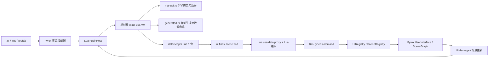
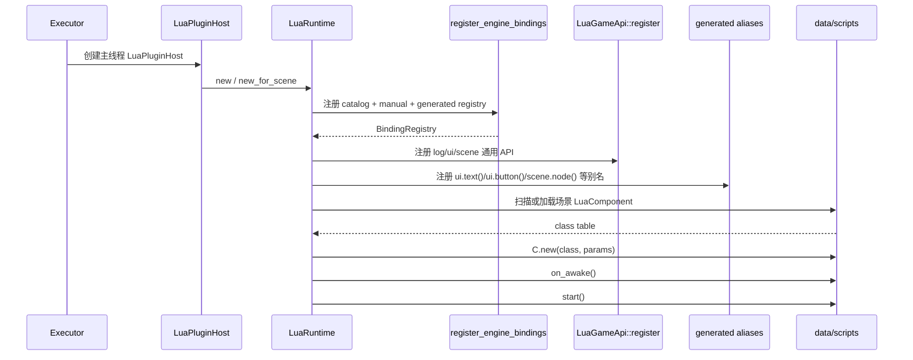
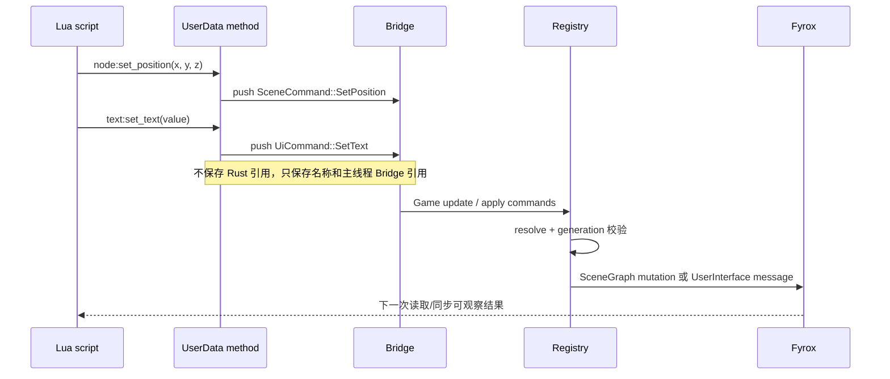
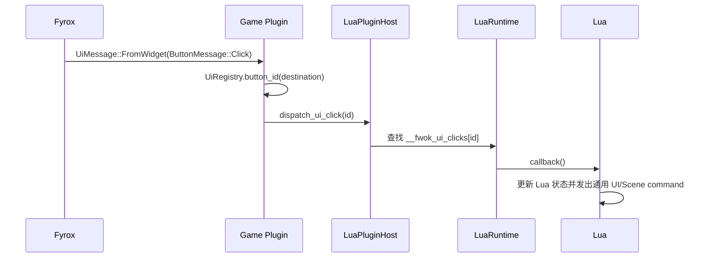
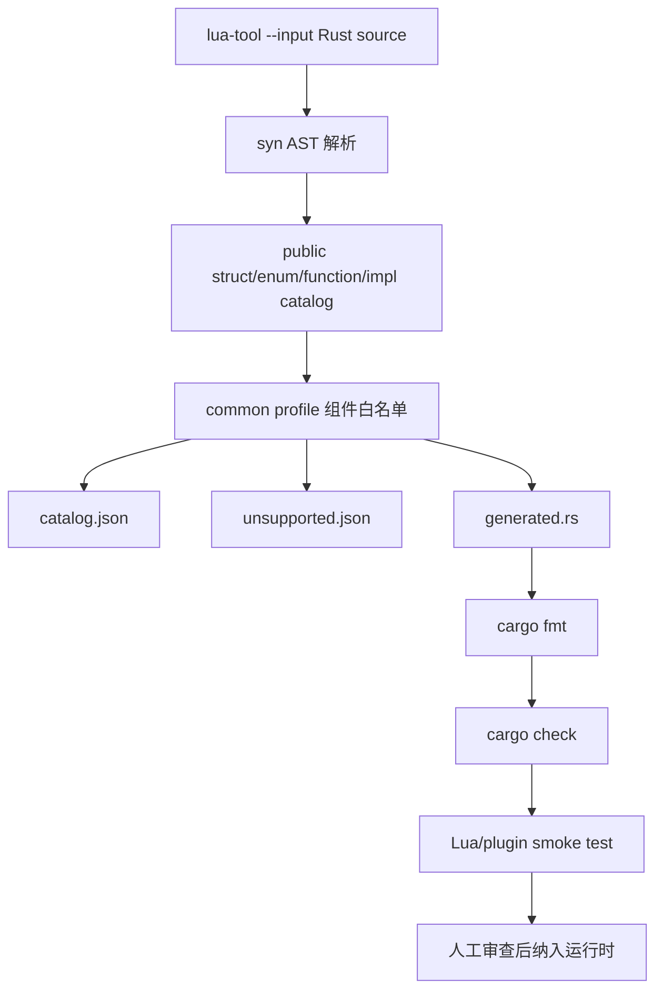

# Lua 绑定注册与 Fyrox 组件调用流程

本文描述 `lua-plugin` 当前的绑定边界、`lua-tool` 离线生成流程，以及 Lua 查找和操作 Fyrox UI/3D 资源的完整调用路径。

## 1. 总体边界



核心约束：资源先于代码存在；Lua 只查找、缓存和操作已有对象。绑定层可以提供通用查找、句柄、消息和生命周期能力，但不能按业务名称创建节点或实现聊天、背包等业务流程。

## 2. 绑定分层

| 层                  | 文件                                     | 职责                                                 | 不负责                     |
| ------------------- | ---------------------------------------- | ---------------------------------------------------- | -------------------------- |
| 手写运行时 userdata | `lua-plugin/src/game_api.rs`           | `UiComponentRef`、`SceneNodeRef` 的实际 Lua 方法 | 业务判断、动态创建生产节点 |
| 手写绑定目录        | `lua-plugin/src/bindings/manual.rs`    | 高频 UI/3D 类型和方法的审计元数据                    | 扫描 Rust 源码             |
| Fyrox API 目录      | `lua-plugin/src/bindings/catalog.rs`   | 记录尚未实现 wrapper 的公开类型                      | 对 Lua 暴露假 API          |
| 自动生成目录        | `lua-plugin/src/bindings/generated.rs` | `lua-tool` 生成的类型、方法和 common profile 别名  | 未经批准的动态反射         |
| 运行时装配          | `lua-plugin/src/runtime.rs`            | 创建 VM、注册绑定、加载脚本、生命周期调度            | 游戏业务                   |
| 主线程宿主          | `lua-plugin/src/plugin.rs`             | 线程归属、host 生命周期和通用事件转发                | 业务组件注册               |

### 2.1 当前常用手写组件

UI：`UiWidgetRef`、`UiTextRef`、`UiTextBoxRef`、`UiButtonRef`。

3D：`SceneNode3DRef`、`SceneSpatialRef`、`SceneMeshRef`、`SceneCameraRef`。

这些类型的元数据状态为 `Implemented`，实际调用统一落到缓存的 UI/Scene proxy。它们描述的是能力边界，不代表运行时会自动创建同名节点。

## 3. 启动与注册顺序



`generated` 别名注册发生在 `LuaGameApi::register` 之后，因此它只在 `ui`、`scene` 表已经存在时挂载；没有业务 API 的最小测试 VM 会跳过别名，不会启动失败。

## 4. Lua 查找与缓存流程

```mermaid
flowchart TD
    A[Lua: ui.find("chat_log")] --> B{Lua registry cache 命中?}
    B -->|是| C[返回已有 AnyUserData proxy]
    B -->|否| D[创建 UiComponentRef]
    D --> E[发送 UiCommand::Resolve]
    E --> F[下一次宿主帧 UiRegistry.resolve]
    F --> G{UserInterface 中存在同名节点?}
    G -->|否| X[记录 unresolved 警告，不创建替代节点]
    G -->|是| I[find_by_name_from_root 一次扫描]
    I --> J[缓存 typed Handle + generation]
    J --> C
```

场景节点路径同理：`scene.find("BoxB")` 创建 `SceneNodeRef`，宿主通过 `SceneRegistry` 首次查找，后续使用缓存 `Handle<Node>` 并检查 generation。资源重载或句柄失效时移除缓存并报告诊断。

## 5. Lua -> Rust 调用



当前通用 UI 方法：

```lua
local title = ui.text("hud_title")
title:set_text("Lua title")
title:set_visible(true)
title:set_enabled(true)
title:set_position(24, 18)

local button = ui.button("send_button")
button:on_click(function()
    log.info("send button clicked")
end)
```

当前通用 3D 方法：

```lua
local box = scene.mesh("BoxB")
box:set_position(1.0, 0.0, 0.0)
box:set_rotation(0.0, 0.0, 1.57)
box:set_scale(1.0, 1.0, 1.0)
box:set_enabled(true)
```

`ui.text`、`ui.button`、`scene.mesh` 等 common profile 入口最终仍调用通用 `find`；类型名称进入离线目录和 API 审计，生产资源缺失时不会自动创建对象。

## 6. Rust -> Lua 调用



脚本事件使用同样的生命周期入口：`dispatch_event(name, payload)` 调用每个实例的 `on_event(name, payload)`。事件名称和业务含义由 Lua 定义，Rust 只负责传输通用字符串或序列化 payload。

## 7. 离线自动绑定流程



命令：

```powershell
.\scripts\generate-lua-bindings.ps1
```

输出的 `generated.rs` 只生成稳定的注册元数据和 common profile 查找别名，不生成未经审查的任意 Fyrox 方法 wrapper。复杂方法、异步资源、trait object、生命周期敏感接口继续进入 `unsupported.json`，由手写绑定处理。

## 8. 生命周期与错误路径

```text
创建 VM
  -> 注册 catalog/manual/generated
  -> 注册通用 ui/scene/log API
  -> 注册 common 组件别名
  -> 加载 data/scripts 或场景 LuaComponent
  -> new(params)
  -> on_awake
  -> start
  -> update(dt) / on_event / UI callback
  -> on_destroy
  -> 清理 callback、实例 registry key 和缓存
```

失败行为：

- Lua 文件缺少 `new`：返回带脚本路径的错误。
- `ui.find`/`scene.find` 找不到资源：记录诊断，保持 unresolved，不构造替代节点。
- Handle generation 失效：丢弃缓存并在下一次显式查找时重新解析。
- Lua callback 抛错：沿 `mlua::Result` 返回到 host，由宿主记录脚本路径和生命周期阶段。

## 9. 验收标准

1. 运行 `lua-tool` 后 `catalog.json` 包含 `components`，`api-diff.md` 显示组件数量。
2. `lua-plugin` 测试验证 `ui.text`、`scene.node` 别名存在，且最小 API VM 没有 `ui/scene` 时仍可启动。
3. 现有 `data/scripts/ui_controller.lua` 继续通过 `ui.find` 和 `scene.find` 操作 `unnamed.ui`、`scene.rgs` 中的真实资源。
4. executor 日志同时出现 UI resolve、scene resolve、Lua lifecycle 和 `draw_commands > 0`。
5. Rust 源码不按业务名称创建 UI/3D 节点，生产 Lua 不调用 `create_*`。
