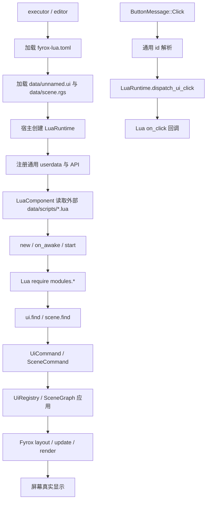

# Fyrox Lua 绑定方案客观对比报告

> 对比对象：
>
> - **FWOK 方案**：`F:/WorkSpaceNew/Fyrox/fwok`
> - **Fyrox-Lua 方案**：`F:/WorkSpaceNew/Fyrox/Fyrox-Lua`
>
> 报告日期：2026-09-15  
> 结论基于两个仓库当前提交，而不是基于路线图中的目标状态。

## 1. 摘要结论

两个方案解决的问题并不完全相同：FWOK 优先解决“在不修改 Fyrox 引擎代码的前提下，把 Lua 接入现有游戏、场景和 UI，并且保证资源优先、生命周期和热重载可控”；Fyrox-Lua 优先探索“把 Lua 脚本作为 Fyrox 原生 Script，借助 `Reflect`、元数据和自动绑定逐步覆盖更广的引擎 API”。前者是可运行时集成方案，后者仍是早期技术验证方案。

按当前仓库的可验证状态，结论如下：

1. **当前项目交付和问题定位应以 FWOK 方案为基线。** 它已有集中式 `LuaRuntime`、外部 `.lua` 资源、真实 UI 查找、UI 按钮消息转发、场景命令和脚本生命周期测试；实际运行链路已经能用日志、节点数、绘制命令和点击事件交叉验证。
2. **Fyrox-Lua 的长期设计上限更高，但当前不能作为完成的通用绑定层。** 其 `ReflectUserData`、`ScriptObject`、`NodeBasedExpression` 和 bindgen 方向有潜力减少手写 wrapper，但当前仍有未实现的 `todo!()`、占位方法、未闭合的生命周期调用、静态泄漏和线程本地上下文等问题。
3. **性能不能简单地判定“反射一定慢”或“手写一定快”。** FWOK 的稳定路径是类型化句柄加命令队列，适合高频更新；Fyrox-Lua 的反射路径更灵活，但每次字段访问都可能发生路径遍历、动态类型转换和借用检查。真正的选择应由基准测试决定，而不是由架构名称决定。
4. **推荐采用分层融合，而不是直接替换。** 保留 FWOK 的资源、生命周期、错误隔离和热重载边界；将 Fyrox-Lua 的离线元数据生成、类型注解和可审计代码生成作为第二层工具，最终生成稳定的 Lua userdata/句柄 wrapper。不要把运行时全量动态反射作为发布版本的唯一 API。

## 2. 范围、版本和证据等级

### 2.1 仓库快照

| 项目 | 当前提交 | Lua 后端 | 引擎依赖 | 主要脚本目录 |
|---|---|---|---|---|
| FWOK | `0972a3f initialize` | `mlua 0.12.1`，默认 `lua54`，可选 LuaJIT feature | 工作区外部 `../Fyrox/fyrox` | `data/scripts` |
| Fyrox-Lua | `43c1854 experiments` | `mlua 0.9.1`，`luau` | 仓库内 `engine/fyrox` 和 `engine/editor` | `scripts` |

Fyrox-Lua 的最近历史明确显示它仍处于实验阶段：提交信息包含 `experiments`、借用规则导致的“不工作”记录和早期文档提交。FWOK 的工作树包含较多项目修改，但本报告只比较当前源码和已记录的运行验收，不把未提交状态当作上游版本承诺。

### 2.2 可量化事实

统计范围是绑定和游戏实现源码，不包含外部 Fyrox 引擎依赖；行数是源码物理行数，用于估算维护面，不代表功能数量。

| 指标 | FWOK | Fyrox-Lua | 解释 |
|---|---:|---:|---|
| Rust 文件 | 22 | 28 | Fyrox-Lua 包含 bindgen、脚本运行时和原型工具 |
| Rust 行数 | 约 2,584 | 约 20,243 | Fyrox-Lua 的 `bindgen/expand.rs` 是展开后的引擎源码，不能直接视为已完成 wrapper |
| 项目 Lua/Luau 文件 | 4 | 5 | 不含引擎自带示例资源 |
| 项目 Lua/Luau 行数 | 约 143 | 约 98 | 只代表示例规模，不代表 API 覆盖 |
| `#[test]` 数量 | 17 | 0 | FWOK 测试集中在 `lua-binding`，Fyrox-Lua 当前没有自动化测试 |
| `todo!`/`unimplemented!` | 0 | 7 | Fyrox-Lua 的 5 个来自 bindgen item parser，2 个来自脚本表达式路径 |
| `Box::leak` / `thread_local!` | 0 | 3 处命中 | Fyrox-Lua 用于 VM 和 `ScriptContext` 生命周期桥接 |
| 真实 UI 验收 | 有 | 未发现同等验收 | FWOK 有节点、绘制命令和按钮点击日志 |

### 2.3 证据分级

- **已验证事实**：可以由源码、测试或运行日志直接确认，例如 FWOK 的 `ui.find` 命中、`draw_commands > 0` 和 `ButtonMessage::Click` 路由。
- **理论推断**：基于数据结构和调用路径推导的复杂度或长期收益，例如反射路径访问比类型化句柄更可能产生额外转换成本。
- **未完成/风险**：源码中明确存在占位、`todo!()`、panic 或缺少端到端验证的地方。此类内容不能当作已交付能力。

### 2.4 构建验证边界

FWOK 当前工作区已验证：`cargo fmt --all -- --check`、`cargo check --workspace` 和 `cargo test -p lua-binding --no-default-features --features "lua54,package"` 通过；编译仅有已有的未使用导入/变量 warning。

Fyrox-Lua 当前工作区无法开始编译：`Cargo.toml` 引用了 `engine/fyrox` 和 `engine/editor`，但当前 `engine/` 目录没有对应 Cargo manifest，`cargo check --workspace` 在解析 workspace member 时即失败。这一项属于依赖/子模块未就绪的外部阻断，不应被误写成“代码已经编译通过”，也不单独证明源码一定不能编译；源码风险仍以静态检查和实际文件内容为依据。

## 3. 两个方案的核心思路

### 3.1 FWOK：宿主集中运行时 + 资源优先 + 通用命令

FWOK 的主要入口是 [`lua-binding/src/runtime.rs`](../lua-binding/src/runtime.rs)。`LuaRuntime` 持有一个 VM、脚本实例列表、生命周期 registry key、绑定目录和统计状态。场景上的 `LuaComponent` 只保存外部 Lua 资源、导出参数和组件句柄；运行时读取真实场景后实例化 Lua 类。

引擎侧不为 `inventory_button`、`chat_log` 或 `BoxB` 编写业务分支。`ui.find(name)` 和 `scene.find(name)` 只创建通用 proxy；业务脚本决定什么时候查找、修改什么文本、绑定什么回调和如何计算动画。Rust 侧只提供 userdata、名称到句柄的解析、命令队列、生命周期调度和输入消息转发。



当前示例中的真实验收信号包括：

```text
[Lua] ui.find resolved existing UI node: task
[Lua] ui.find resolved existing UI node: chat_log
[Lua] ui.find resolved existing UI node: send_button
[UI] diagnostic: nodes=15, visible=15, visual_valid=15, draw_commands=14
[Lua] UI click routed: id=inventory_button
[Lua] UI click routed: id=send_button
```

这组日志不能单独证明所有画面正确，但它同时覆盖了资源存在、布局有效、渲染命令和输入路由四个不同层面。

### 3.2 Fyrox-Lua：原生 Script 包装 + Reflect 路径 + 元数据/生成器

Fyrox-Lua 的入口是 [`game/src/plugin.rs`](../../Fyrox-Lua/game/src/plugin.rs)。插件在 `register` 阶段创建长期存在的 Lua VM，设置 `package.path`，遍历 `scripts`，读取脚本头部的 `---@uuid`、`---@class` 和 `---@field` 元数据，然后把每个脚本注册为 Fyrox `ScriptConstructor`。

脚本对象由 `ScriptData` 在 `Packed(ScriptObject)` 和 `Unpacked(UserDataRefMut)` 之间转换。`ScriptObject` 实现 `Reflect`，字段访问由 [`lua_reflect_bindings.rs`](../../Fyrox-Lua/game/src/lua_reflect_bindings.rs) 的 `__index`/`__newindex` 元方法按路径动态求值。`NodeBasedExpression` 以 `Handle<Node>` 和字段路径表示场景节点上的可变值。

```mermaid
flowchart TD
    A[LuaPlugin::register] --> B[Box::leak Lua VM]
    B --> C[package.path = scripts]
    C --> D[WalkDir 扫描 Lua 文件]
    D --> E[解析 uuid / class / field]
    E --> F[require(class)]
    F --> G[注册 ScriptConstructor]
    G --> H[Fyrox 从场景构造 LuaScript]
    H --> I[Packed ScriptObject]
    I --> J[首次 on_update 时转为 Unpacked userdata]
    J --> K[ReflectUserData __index / __newindex]
    K --> L[按 path 动态访问 Rust Reflect]
```

这个方向的理论优点是：脚本字段可以进入 Fyrox 的 Inspector/Visit/Reflect 体系，且未来可以通过 rustdoc 或反射元数据自动生成大量绑定。当前提交并没有闭合这条链路：`LuaScript::on_update` 只展示了 packed/unpacked 转换，没有看到调用 Lua 类 `on_update` 的实现；`LuaScriptBasedExpr` 的地址和 sibling 仍为 `todo!()`；`EngineUd` 的接口是占位方法。

## 4. 实现模型逐项比较

| 维度 | FWOK 当前实现 | Fyrox-Lua 当前实现 | 客观影响 |
|---|---|---|---|
| VM 创建 | `LuaRuntime::new` 创建 VM，生命周期由宿主字段持有 | `LuaPlugin` 用 `Box::leak` 形成 `'static Lua` | FWOK 释放边界清晰；Fyrox-Lua 简化了 mlua 生命周期，但增加泄漏、重载和多 VM 风险 |
| 脚本发现 | `fyrox-lua.toml` 指定 `data/scripts`，场景组件可精确加载；根目录模式跳过 `modules` | `WalkDir::new("scripts")` 全目录扫描，逐文件解析 metadata | FWOK 语义分为“组件”和“模块”；Fyrox-Lua 容易把模块、组件和工具脚本混为注册对象 |
| 脚本实例 | Lua class table + `new(class, params)`，方法 key 存入 registry | Fyrox `ScriptConstructor` + `ScriptObject` 字段数组 | FWOK 调度直接；Fyrox-Lua 与场景序列化/Inspector 结合更紧密 |
| 绑定入口 | `Api::register` 注册 `ui`、`scene`、`log`；catalog 是审计目录 | `lua_bindings.rs` 手写少量 userdata，反射模块尝试覆盖字段 | FWOK 边界可审计；Fyrox-Lua 类型覆盖理论更大但当前实现不完整 |
| 类型安全 | UI/场景句柄在 Rust 中区分 `Text`、`TextBox`、`Button`；脚本层是通用 proxy | LuaTableKey + 动态 `Reflect` downcast | FWOK 错误较早暴露；Fyrox-Lua 灵活但错误在运行时发生 |
| UI | `ui.find` 解析真实 `UserInterface`，缓存 typed Handle；按钮消息可回 Lua | 当前源码未见 `UserInterface`、Button 或 UI find 的完整 wrapper | FWOK 已有可验证 UI 链路；Fyrox-Lua UI 能力尚未证明 |
| 场景节点 | `scene.find` 代理当前按名称发送通用 transform 命令；应用端每次命令再查名 | `NodeBasedExpression` 保存 `Handle<Node>` 和路径，但创建/暴露路径未闭合 | Fyrox-Lua 的句柄模型理论上更适合高频访问；FWOK 当前场景路径仍需优化缓存 |
| 事件 | `dispatch_ui_click`、`dispatch_script_event` 集中调度 | 主要设计依赖 Fyrox ScriptContext；完整事件总线尚未形成 | FWOK 更容易诊断和热重载；Fyrox-Lua 更贴近引擎原生回调但耦合更深 |
| 序列化 | `LuaScript` 资源和 `LuaComponent` 用 Fyrox Resource/Visit；运行时状态集中在宿主 | `ScriptData`/`ScriptObject` 实现 Visit/Reflect，字段可进入 Inspector | Fyrox-Lua 在编辑器字段模型上有潜力；当前 packed/unpacked clone 语义不完整 |
| 热重载 | 有 `reload_script`，会调用旧 `on_destroy`、移除 registry key、重新加载脚本 | 当前插件注册阶段扫描一次；未见等价文件 watcher/实例替换流程 | FWOK 更接近可用；Fyrox-Lua 需要先定义脚本构造器、UUID、模块缓存和场景实例的一致性 |
| 线程模型 | VM 调用和桥接由宿主主线程调度，命令队列可隔离资源访问 | `thread_local!` 只允许当前线程有 ScriptContext，`SendWrapper` 绕过 Send 边界 | Fyrox-Lua 对异步、并行和跨 yield 的约束更强 |
| 引擎依赖 | 不要求改 Fyrox 核心；绑定放在独立 crate | 依赖 Fyrox Script/Reflect 细节，仓库含自己的 engine 路径 | FWOK 易于跟随上游；Fyrox-Lua 可获得更深集成但升级成本更高 |

## 5. 绑定方式和 API 覆盖

### 5.1 FWOK 的优点和边界

FWOK 的绑定分为三层：

1. **稳定通用 API**：`ui.find`、`scene.find`、`on_click`、`set_text`、`set_visible`、`append`、`set_position`、`set_rotation_z` 和日志函数。
2. **运行时协议**：`UiCommand`、`SceneCommand`、`Bridge` 和 `UiRegistry`。该协议只传输名称、值和通用操作，不传输业务状态。
3. **审计目录**：[`bindings/catalog.rs`](../lua-binding/src/bindings/catalog.rs) 登记 Fyrox 类型和分类，`BindingStatus::CatalogOnly` 明确表示“已登记但没有 wrapper”。

这个分层避免了“catalog 中出现一个类型就意味着 Lua 真的可以调用它”的误导。但是，当前 [`register_engine_bindings`](../lua-binding/src/bindings/mod.rs) 主要建立目录，未实现对所有 catalog 类型的真实 wrapper 注册。`EditorReflection` 和 `PackageFull` 在配置中存在，源码中尚未看到完整的运行时反射分派或全量发布 wrapper。因此当前应把它理解为“可审计的 API 规划和少量真实基础 API”，而不是完整 Fyrox binding。

### 5.2 Fyrox-Lua 的优点和边界

Fyrox-Lua 把 `Reflect` 当作访问基础设施：

- `ReflectUserData` 对字段访问安装统一的 `__index` 和 `__newindex`。
- `LuaTableKey` 支持字符串字段和数组索引。
- 基础类型、字符串、路径和 `Vector3` 有转换器。
- `NodeBasedExpression` 保存场景节点句柄和路径，理论上可实现 `node.local_transform.position.x` 这样的链式读写。
- `bindgen` 试图从源码、rustdoc JSON 或展开后的引擎代码中收集元数据，长期目标是自动生成注解和 wrapper。

但当前 bindgen 不是完成的生成器：`parse_item.rs` 对 struct、trait、union 和未知 item 仍使用 `todo!()`；`rustdoc_based/mod.rs` 没有完整实现；现有 parser 主要收集公开 free function 和 type alias，没有生成 `mlua::UserData` wrapper 的闭环。`bindgen/expand.rs` 的大体量主要是引擎宏展开结果，不能按行数当作 Lua API 覆盖。

此外，`EngineUd` 的 `cast_ray` 和 `send_message` 当前只返回 `Ok(())`；脚本示例中的 `engine:raycast`、节点销毁和脚本添加因此不能按“已可用接口”评估。

## 6. UI、场景和资源流程

### 6.1 FWOK 的资源优先路径

FWOK 的规则文件和当前资源约定为：

- Lua 唯一目录为 `./data/scripts`。
- UI 节点先在 `data/unnamed.ui` 创建，Lua 通过名字查找。
- 场景节点先在 `data/scene.rgs` 创建，Lua 通过 `scene.find` 获取。
- `.rgs`/prefab 不内嵌 Lua 源码；组件引用外部 `LuaScript` 资源。
- `create_*` 保留为通用能力/测试，但正常业务脚本不调用。

第一次 `ui.find` 会通过 `find_by_name_from_root` 扫描 UI 树并缓存 `Handle<Text|TextBox|Button>`；之后 UI 操作直接使用缓存句柄。资源缺失时记录诊断，不创建幽灵节点。真实验收资源包含 `hud_title`、`task`、`time`、`chat_log`、`chat_input`、`send_button`、`inventory_button` 和 `skill_button`。

这套设计的主要代价是消息延迟：Lua 本帧发出的 UI 命令在宿主下一次应用队列时生效。对 HUD 和按钮交互通常足够，但需要在 API 文档中明确“命令队列”而不是假设同步修改。

### 6.2 FWOK 当前场景查找的限制

UI registry 已经缓存 typed handle；场景的 `SceneNodeRef` 当前保存的是名称，`apply_scene_commands` 在每个位置/旋转命令中再次调用 `find_by_name_from_root`。因此 `scene.find("BoxB")` 的 Lua proxy 语义是缓存 proxy，不是缓存场景句柄。

对于示例中的箱子旋转，这意味着每帧可能产生一次或多次 `O(N_scene)` 名称查找。它不影响小场景的正确性，但在大场景或大量动画对象中会成为明显的可优化点。建议后续让通用 scene registry 缓存 `Handle<Node>` 加 generation，并在场景重载时统一失效；不要在 Rust 中为每个业务名称增加特殊字段。

### 6.3 Fyrox-Lua 的资源访问模型

Fyrox-Lua 主要通过脚本字段获得 `Handle<Node>`、`Vector3` 等值，并通过 Reflect 路径操作它们；这对 Inspector 和序列化很有吸引力，但当前示例没有形成通用 `scene.find`/`ui.find` 协议，也没有看到 UI Button 的 userdata。它更像“把 Script 的字段暴露给 Lua”，而不是“Lua 可按资源名查找整个场景/用户界面”。

因此：

- 对“脚本组件上已有一个节点字段”的工作流，Fyrox-Lua 的理论便捷性较高。
- 对“场景中已有节点，Lua 运行时按名字查找并缓存”的工作流，FWOK 当前更直接、更容易验收。
- 若用户要求不动态创建资源，两者都应把资源声明放在 `.rgs`/`.ui`；Fyrox-Lua 的现有代码并没有提供足够的 UI 证据来证明这一点。

## 7. 生命周期、热重载和序列化

### 7.1 FWOK 生命周期

当前实例生命周期为：

```text
LuaRuntime::new/new_for_scene
  -> 注册基础 API
  -> 加载 Lua class
  -> class.new(class, params)
  -> on_awake
  -> start
  -> update(dt) / on_event(name, payload)
  -> on_destroy
  -> 移除 registry key
```

`reload_script` 会先调用旧实例 `on_destroy`，删除旧的 registry key，再加载新源文件。该设计把 Lua VM 状态集中在 `LuaRuntime`，避免热重载 DLL 后场景组件持有来自已卸载插件的 vtable。

仍需注意两个边界：

1. `reload_script` 没有自动清理 `package.loaded`，因此 `require("modules.x")` 的模块状态可能在脚本重载后保留。若要求模块级热重载，必须定义模块缓存失效和依赖拓扑。
2. `LuaConfig.jit` 当前只被记录和测试读取，`LuaRuntime` 仍直接调用 `Lua::new()`；它不是已生效的运行时 JIT 开关。

### 7.2 Fyrox-Lua 生命周期

Fyrox-Lua 的预期生命周期是 Fyrox `ScriptTrait` 驱动，但当前实现的关键路径没有闭合：

- `plugin.rs` 注册脚本类和构造器。
- `LuaScript::on_update` 首次将 `ScriptData::Packed` 变为 Lua userdata。
- 代码中未看到从保存的类/实例调用 Lua `on_update`、`on_awake` 或 `on_destroy` 的实现。
- `LuaScriptBasedExpr::address` 和 `create_sibling` 仍为 `todo!()`。

这不表示设计不可行，而是表示当前提交不能证明“脚本加载后业务逻辑实际每帧运行”。在没有端到端测试之前，不能拿示例文件中写了 `Bullet:on_update` 当作功能已经可执行。

### 7.3 序列化差异

| 项目 | FWOK | Fyrox-Lua |
|---|---|---|
| 资源源代码 | `LuaScript` 是普通 Fyrox Resource，组件引用资源 | 脚本路径在注册器中扫描，metadata 和类名构成定义 |
| 场景字段 | 组件配置、外部 UUID、导出参数、组件句柄 | `ScriptObject` 字段数组，支持 number/string/bool/Node/Vector3 |
| 运行时状态 | VM 内对象不写回场景；销毁时由 runtime 释放 registry key | `Unpacked(UserDataRefMut<'static, ...>)` 不能 clone；持久化和复制边界未完成 |
| 编辑器可见性 | 参数结构显式、可审计 | Reflect/Visit 理论上更深，但依赖脚本字段类型和生命周期实现 |

## 8. 性能模型和理论成本

以下是结构性成本模型，不是机器上的最终 benchmark。

### 8.1 FWOK

设：

- `S` 为每帧需要执行的 Lua script 数量；
- `C_lua` 为一次 `mlua` 方法调用成本；
- `Q` 为本帧命令数；
- `N_ui` 为 UI 节点数；
- `N_scene` 为场景图节点数。

则单帧大致为：

```text
T_frame_fwok ≈ S * C_lua + Q * (queue_push + apply) + scene_commands * O(N_scene)
```

- UI 首次查找：`O(N_ui)`，命中后 typed handle 访问接近 `O(1)`。
- UI 写入：Lua 到 Rust 一次 userdata 方法调用，加一次命令队列 push；应用时直接按缓存句柄发 Fyrox message。
- UI 点击反查：当前 `UiRegistry::button_id` 遍历已缓存组件，成本约 `O(B)`，`B` 为已注册按钮数。
- 场景写入：当前每个 `SceneCommand` 按名称重新查找，成本约 `O(N_scene)`；这是现阶段最明确的性能债务。
- 模块导入：第一次 `require` 解析和执行源文件，后续由 Lua `package.loaded` 缓存。

FWOK 的优点是成本可预测、句柄类型明确、发布版不依赖运行时全量反射。缺点是跨语言调用和命令队列会产生固定开销，批量属性更新没有专门批处理协议，场景句柄缓存还未完成。

### 8.2 Fyrox-Lua

设 `D` 为 Reflect 路径深度，`K` 为候选类型转换器数量，`F` 为脚本字段数，则动态字段访问近似为：

```text
T_reflect ≈ C_lua + O(D * (field/array traversal)) + O(K * downcast/conversion)
```

- 每次 `__index` 都要获取当前 `ScriptContext`、计算 owner/path、沿字段路径遍历。
- 终值读取会尝试多个 Rust 到 Lua 类型转换器；写入也会按类型尝试转换。
- 路径表达式本身没有看到终端节点缓存；频繁更新同一个深层属性会重复做路径工作。
- `NodeBasedExpression` 保存 Handle 是正确方向，可以把节点定位成本从每次名称查找降到句柄访问，但当前暴露和失效协议尚未闭合。
- 首次启动还包含 WalkDir、脚本 metadata 解析、`require` 和 ScriptConstructor 注册成本。

反射路径的性能可能在低频编辑器操作中完全足够；在每帧大量访问 Transform、物理状态或数组元素时，应通过缓存路径、生成 typed wrapper 或批量 API 降低成本。

### 8.3 性能结论

| 场景 | 更可能有优势的方案 | 原因 | 需要的验证 |
|---|---|---|---|
| 少量 HUD 文本和按钮 | FWOK | UI 查找一次后使用 typed handle，API 直接 | 统计每帧 Lua 调用和命令数量 |
| 大量反射字段编辑 | Fyrox-Lua 设计上有优势 | 无需为每个字段手写 wrapper | 完成 `ReflectUserData` 后测路径访问吞吐 |
| 每帧 Transform 动画 | FWOK（优化 scene handle 后） | 可使用稳定句柄和批量命令 | 场景句柄缓存 benchmark |
| 首次启动很多脚本 | 视脚本数量而定 | FWOK 实例化快；Fyrox-Lua 需 metadata/constructor 注册 | 记录冷启动和首帧时间 |
| 热重载模块依赖 | FWOK 当前更可控 | 有实例替换入口，但需补 module cache 清理 | 修改依赖模块后验证状态是否刷新 |

## 9. 扩展性、维护性和便捷性

### 9.1 性能

FWOK 的“显式 API + typed handle”更接近稳定发布运行时；它的性能债务集中、可定位，主要是命令队列和场景名称查找。Fyrox-Lua 的“Reflect 一套元方法覆盖很多类型”能够降低初始 wrapper 数量，但动态路径和类型转换的成本会随着调用频率放大，而且当前没有 benchmark 证明其实际吞吐。

**判断：当前可用性 FWOK 胜；理论 API 覆盖 Fyrox-Lua 胜；高频场景操作需要双方都采用稳定句柄。**

### 9.2 扩展性

FWOK 新增类型通常需要：定义 userdata、增加通用命令/句柄处理、加入 catalog、编写测试。这是显式成本，但每个 API 的所有权、线程和失效语义清楚。Fyrox-Lua 只要 Reflect 元数据完整，理论上可以自动暴露更多字段；但 Fyrox 的 traits、泛型、资源句柄、消息类型、生命周期和异步资源并不能由简单的 field reflection 自动覆盖。

**判断：Fyrox-Lua 有更高的长期上限，但只有在 bindgen 能处理 struct/impl/trait、类型转换、方法签名和生命周期之后才成立。FWOK 的上限较低但路线更可控。**

### 9.3 可维护性

FWOK 的核心模块较小，`LuaRuntime`、`resource`、`ui`、`game_api` 分工明确；接口变更会显式产生编译错误或测试失败。其风险是项目示例 `game/src/lib.rs` 仍保留 `Player`、`BoxA`、`BoxB` 等业务同步逻辑，这些不属于通用 binding，应继续迁移到 Lua 或通用 scene registry。

Fyrox-Lua 的维护风险主要来自“隐式耦合”：mlua 生命周期、`ScriptContext` 借用、Fyrox `Reflect` 内部协议、脚本 UUID、文件名/类名约定和自动生成器必须同时稳定。`Box::leak` 可以暂时绕过借用困难，但会把释放和热重载问题推迟到系统级别。

**判断：现阶段 FWOK 更容易维护；Fyrox-Lua 若完成代码生成和稳定句柄后才可能降低长期重复劳动。**

### 9.4 开发便捷性

FWOK 的业务脚本写法直观：

```lua
local ui_text = ui.find("chat_log")
ui_text:set_text("hello")
ui_text:on_click(function() ... end)
```

脚本作者不需要理解 Fyrox `Reflect` 路径，也不需要在每个脚本头部声明类 metadata；代价是新增引擎类型时要等 Rust wrapper/API 完成。

Fyrox-Lua 的 metadata 头部和脚本字段有利于 Inspector：

```lua
---@uuid ...
---@class Bullet: Script
---@field velocity Vector3
```

但脚本作者需要理解类名、文件名、UUID、反射字段和引擎 Script 生命周期；当一个能力仍是 `todo!()` 或占位 userdata 时，编辑体验会出现“能写但不能运行”的断层。

**判断：当前业务开发 FWOK 更便捷；完成自动注解、生成 wrapper 并提供 IDE 类型信息后，Fyrox-Lua 的大规模 API 开发体验可能更好。**

### 9.5 资源纪律和安全性

FWOK 的资源优先规则明确禁止通过 Rust 业务代码动态创建节点来掩盖资源缺失，且 UI 验收直接检查真实序列化节点。当前仍保留 `source_override` 和 `create_*`，它们必须继续限定为编辑器原型/通用测试，否则会破坏资源真相。

Fyrox-Lua 的原生 ScriptConstructor 适合把脚本挂到场景节点，但目前脚本目录扫描和 metadata 注册是全局的，缺少“模块”和“场景组件”的明确边界。若直接让所有 `scripts/*.lua` 都成为构造器，会增加 UUID、路径、重命名和资源包的一致性风险。

## 10. 风险清单

### 10.1 Fyrox-Lua 高优先级风险

| 风险 | 证据 | 影响 | 建议 |
|---|---|---|---|
| Lua 业务 update 链路未闭合 | `LuaScript::on_update` 只做 packed/unpacked 转换，未发现 Lua method dispatch | 脚本可能注册成功但业务逻辑不执行 | 先实现并测试 `new/on_awake/update/on_destroy` 完整调用 |
| 脚本表达式未完成 | `LuaScriptBasedExpr::address/create_sibling` 为 `todo!()` | 访问脚本自有字段或链式属性会直接 panic | 使用稳定 Script handle + path cache，禁止在发布路径 `todo!()` |
| bindgen 不是完整生成器 | struct/trait/union/unknown item 分支为 `todo!()`；rustdoc_based 模块为空 | 无法依靠它自动覆盖 Fyrox API | 先定义支持矩阵和失败报告，再输出可编译 wrapper |
| VM 静态泄漏 | `Box::leak(Box::new(Lua::new()))` | VM 无正常释放；热重载、多 VM、资源析构困难 | 用宿主所有权或明确的 process-lifetime 单例，并记录不可热卸载边界 |
| TLS ScriptContext | `thread_local!` 保存 `'static mut ScriptContext` | 非主线程、异步回调和跨 yield 访问受限 | 把上下文显式传递给调用，或建立主线程 command channel |
| 占位引擎 API | `EngineUd::cast_ray/send_message` 返回 `Ok(())` | 示例逻辑不能当作真实能力 | 每个导出函数必须有集成测试和错误语义 |
| metadata 解析不健壮 | `ScriptObject::field/field_mut` 使用 map 索引，未知字段可能 panic | Lua 拼写错误变成进程级 panic | 改为 `get` 并返回带路径的 Lua error |
| 缺少自动化测试 | 当前仓库统计为 0 个 `#[test]` | 重构无法防止生命周期回归 | 先建立 VM、metadata、Reflect、场景、热重载测试矩阵 |

### 10.2 FWOK 中优先级较高的改进项

| 风险 | 证据 | 影响 | 建议 |
|---|---|---|---|
| 目录状态不等于真实 wrapper | catalog 有 `CatalogOnly`，注册入口主要建立目录 | Lua 作者可能误以为 Fyrox 类型已可用 | 生成机器可读 API 状态，并在 Lua 启动时拒绝未实现类型 |
| scene proxy 未缓存 Handle | `SceneNodeRef` 保存名称，应用命令时再次查找 | 大场景每帧名称查找成本高 | 增加通用 `SceneRegistry`，缓存 Handle + generation |
| 命令队列是异步语义 | UI 命令在下一次宿主更新时应用 | 脚本作者可能误判读写顺序 | 提供显式批处理/flush 或在文档中固定帧语义 |
| `jit` 配置目前不生效 | 配置被记录，但 runtime 固定 `Lua::new()` | 调优配置产生错误预期 | 明确删除字段，或按 feature 创建对应 Lua backend |
| 模块热重载缓存 | `reload_script` 未清理 `package.loaded` | 依赖模块可能保留旧闭包/状态 | 增加依赖图和 module cache invalidation |
| 原型接口仍可动态创建 | `create_text/create_text_box/create_button` 保留 | 业务可能绕过 `.ui` 资源真相 | 在发布模式隐藏 create API，或增加明确 capability gate |
| 示例宿主仍有业务代码 | `game/src/lib.rs` 直接同步 Player/BoxA/BoxB | binding 与业务边界仍不完全干净 | 将示例玩法状态和节点同步迁移到 Lua/通用 scene API |

## 11. 评分矩阵

评分范围为 0 到 5：0 表示当前不可用，5 表示在当前证据下已达到稳定工程目标。评分不是“设计潜力”评分；潜力单独列出。

### 11.1 当前提交的工程可用性

| 维度 | FWOK | Fyrox-Lua | 评分理由 |
|---|---:|---:|---|
| 运行链路正确性 | 4.0 | 1.5 | FWOK 有真实 UI/场景/点击验收；Fyrox-Lua 未证明 Lua update dispatch |
| UI/场景资源工作流 | 4.2 | 1.5 | FWOK 有 `find + cache` 和真实 `.ui` 节点；Fyrox-Lua 未见完整 UI binding |
| 高频调用性能可预测性 | 3.3 | 2.2 | FWOK 的命令和句柄成本可估算但 scene 未缓存；Fyrox-Lua 为动态 Reflect 路径 |
| API 当前覆盖 | 2.3 | 1.6 | FWOK 明确但范围小；Fyrox-Lua 有少量 userdata，EngineUd/表达式仍占位 |
| 扩展实现成本 | 3.0 | 2.1 | FWOK 需要手写 wrapper；Fyrox-Lua 生成器尚未闭环 |
| 可维护性 | 3.7 | 1.9 | FWOK 模块职责和错误边界清楚；Fyrox-Lua 有 TLS、leak 和引擎内部耦合 |
| 热重载 | 3.6 | 1.4 | FWOK 有脚本实例替换入口；Fyrox-Lua 当前主要是启动注册 |
| 测试和可观测性 | 4.0 | 0.8 | FWOK 17 个测试和 UI 诊断；Fyrox-Lua 当前无 `#[test]` |
| 业务开发便捷性 | 3.8 | 2.3 | FWOK Lua API 直接；Fyrox-Lua metadata/Reflect 方向有潜力但占位较多 |
| **当前加权平均** | **3.6** | **1.7** | 权重偏向运行正确性、资源和可维护性 |

### 11.2 完成目标后的设计潜力

| 维度 | FWOK 上限 | Fyrox-Lua 上限 | 说明 |
|---|---:|---:|---|
| 大规模类型覆盖 | 3.5 | 4.5 | Fyrox-Lua 若生成器完善，可减少重复 wrapper |
| 发布性能 | 4.2 | 3.5 | FWOK 可生成/手写稳定 wrapper；反射方案需缓存或转静态调用 |
| Inspector/序列化整合 | 3.8 | 4.5 | Fyrox-Lua 原生 Script + Reflect 更接近引擎编辑器模型 |
| 热重载可控性 | 4.2 | 3.2 | FWOK 已有宿主边界；Fyrox-Lua 需解决 VM、UUID、脚本实例和模块状态 |
| 不修改引擎的独立性 | 4.6 | 2.5 | FWOK 绑定在外部 crate；Fyrox-Lua 深依赖 Script/Reflect 和 engine fork |
| API 设计一致性 | 4.0 | 4.0 | 两者都可通过统一句柄和元数据达到良好一致性 |

第二张表不是承诺：Fyrox-Lua 的高分成立的前提是补齐所有未实现路径、建立测试、定义句柄失效语义，并把动态反射限制在合适的场景。

## 12. 推荐的融合实现路线

### 阶段 0：保持当前可运行基线

继续使用 FWOK 的 `LuaRuntime`、资源 loader、`LuaComponent`、UI registry 和命令协议。验收必须同时包含：

```text
真实资源存在 -> ui.find 成功 -> visual_valid/draw_commands > 0 -> ButtonMessage::Click -> Lua callback
```

Lua 业务只放在 `data/scripts`；不在 Rust 中增加业务名称分支，不通过动态创建节点隐藏资源缺失。

### 阶段 1：完善通用 Handle 层

引入通用 `SceneRegistry` 和统一 `HandleToken { index, generation, resource_id }`：

- UI 和 Scene 都首次按名称查找，后续按句柄访问。
- 场景/用户界面资源重载时统一使 generation 失效。
- Lua proxy 保存 token，而不是每次保存名称并重新扫描。
- Rust 只处理资源、句柄和生命周期，不认识业务名称。

这一步同时解决性能和安全问题，比直接把全部 Fyrox `Reflect` 暴露给 Lua 更重要。

### 阶段 2：把 Fyrox-Lua 的元数据能力改成离线工具

借鉴 `rustdoc_types`、`Reflect::fields_info` 和 `bindgen` 的方向，但生成结果必须是可审计的清单和静态 wrapper：

1. 解析 struct/impl/trait/enum/泛型时，不支持的 item 输出诊断，不允许 `todo!()` 进入运行时。
2. 生成 `BindingType`、方法签名、Lua 注解和 wrapper 草稿。
3. 每个生成类型必须有类型转换、错误、Handle generation 和线程语义。
4. 生成器输出进入 CI diff，API 变更可审查。
5. 编辑器反射模式可以加载 metadata，但发布模式使用生成的静态注册。

这样既获得 Fyrox-Lua 的覆盖扩展性，又避免发布时对全量动态反射、TLS 上下文和 `'static Lua` 的依赖。

### 阶段 3：定义脚本组件模型

如果需要 Fyrox 原生 Inspector 体验，可吸收 Fyrox-Lua 的 `---@uuid`、`---@class` 和 `---@field`，但让 metadata 成为 `LuaScript` 资源的静态描述，不让脚本目录扫描自动把所有模块变成场景 ScriptConstructor：

- `module` 和 `component` 使用不同 metadata 标签或 `.meta` 文件。
- UUID、外部资源路径和类名变更必须有迁移检查。
- 字段类型超出支持矩阵时在加载阶段报错，不在运行时 panic。
- `new/on_awake/start/update/on_destroy` 调度统一由一个 runtime 实现。

### 阶段 4：再评估 Luau

如果团队确实需要 Luau 的类型语法、沙箱或语言体验，可把 Luau 作为第二个 backend，但先固定宿主 API 和句柄 ABI。不能因为更换 Lua backend 就重新设计 UI、资源和生命周期协议。

## 13. 建议的基准和验收测试

在决定是否引入 Fyrox-Lua 的反射层前，建议建立同一组测试。所有测试应在相同引擎版本、相同优化级别和相同脚本数量下运行。

### 13.1 正确性测试

1. 启动 100 个脚本，验证 `new -> on_awake -> start` 顺序和实例数量。
2. 每个脚本执行 10,000 次 `update(dt)`，验证计数、错误传播和 on_destroy。
3. UI 场景包含 1,000 个节点，查找 100 个命名 Text/Button，验证首次查找、缓存命中和资源重载后的 generation 失效。
4. 点击真实 Button，验证 Fyrox `UiMessage` 到 Lua callback 的端到端链路。
5. 修改模块后热重载，验证 `package.loaded` 中旧闭包和旧状态是否清理。
6. 删除/替换场景节点后访问旧 proxy，必须返回可诊断的 invalid handle 错误，不能访问悬空引用。

### 13.2 性能测试

记录以下指标的 p50、p95 和每帧峰值：

| 基准 | 目标指标 |
|---|---|
| 冷启动 | VM 创建、脚本发现、metadata 解析、首帧完成时间 |
| 空 update | 单个 Lua callback 的纳秒/微秒成本 |
| UI set_text | proxy 调用、命令 push、Fyrox message 应用总成本 |
| Scene transform | 名称查找路径与 cached Handle 路径对比 |
| Reflect field | 深度 1/3/6 的 `__index`、`__newindex` 成本 |
| 批量脚本 | 10/100/1,000 个实例下的帧时间和分配次数 |
| 热重载 | 依赖模块数量、实例销毁/重建时间、旧状态残留 |

### 13.3 发布前硬门槛

- 运行时不得存在业务路径上的 `todo!()`、`unimplemented!()` 或不可恢复的 `panic!()`。
- 所有真实导出的 API 都有至少一个 Rust 单元测试和一个 Lua 集成测试。
- UI 验收必须看到真实节点和绘制命令，Lua 日志不能作为唯一证据。
- 所有 `unsafe`、`Box::leak`、`SendWrapper` 和 TLS 使用点都有所有权/线程说明和压力测试。
- `create_*` 只能在测试或明确授权的编辑器原型模式启用。
- 脚本路径固定为 `data/scripts`，模块导入和资源 UUID 在打包后仍有效。

## 14. 最终客观判断

如果目标是“现在就让 Lua 操作现有 `unnamed.ui`、监听按钮、驱动场景中已有箱子，并且不修改 Fyrox 引擎代码”，**FWOK 是更合适的工程基线**。它的主要问题是 API 覆盖尚不完整、场景句柄缓存还需要补齐、示例宿主仍有部分 Rust 业务逻辑，以及 `jit`/module reload 等配置边界需要收紧。这些问题是可定位、可测试的工程债务。

如果目标是“长期自动覆盖大量 Fyrox 类型、让脚本字段进入 Inspector、减少手写 wrapper”，**Fyrox-Lua 的 Reflect + metadata + bindgen 方向值得吸收**。但当前提交不能被评估为完成方案：Lua update 调用链未证明，表达式和生成器有明确未实现路径，Engine API 存在占位，VM 生命周期通过泄漏和 TLS 规避借用，且没有自动化测试。

因此最客观的选择不是二选一，而是：

```text
FWOK 负责可运行的宿主、资源、句柄、生命周期和热重载边界
        +
Fyrox-Lua 负责离线元数据、注解和可审计的 wrapper 生成工具
        -> 发布版使用稳定、类型化、可测试的 Lua API
```

在 Fyrox-Lua 完成上述阻断项并通过同一套端到端测试之前，不建议把它替换为当前 FWOK 的运行时绑定层，也不建议把其动态反射原型直接用于生产游戏逻辑。
