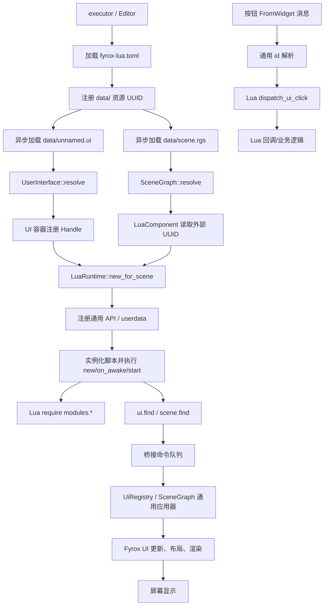
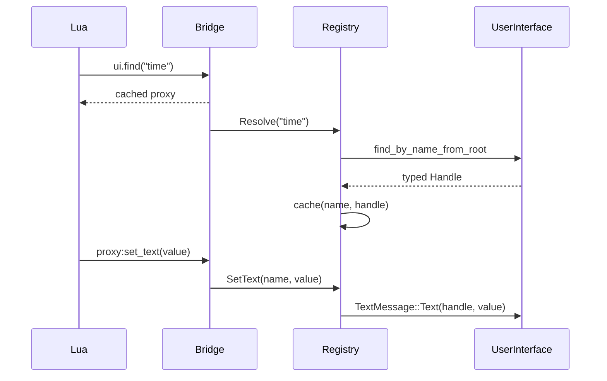
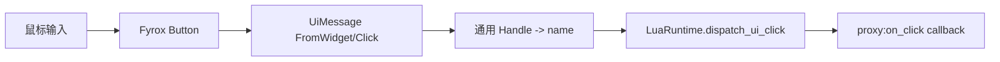

# FWOK Lua 运行时、UI 查找与资源优先方案

本文描述当前实现的真实边界和运行顺序。它不是“在 Rust 中为每个控件写一段业务适配”的方案：场景和 UI 资源负责声明对象，Lua 负责业务，Rust 只负责通用运行时、句柄、消息和生命周期。

## 1. 资源约束

| 资源 | 唯一路径 | 作用 |
|---|---|---|
| Lua 根目录 | `./data/scripts` | 所有 Lua 源文件、模块和 `.meta` |
| UI | `data/unnamed.ui` | 预先创建 Canvas、Text、Button 等节点 |
| 场景 | `data/scene.rgs` | 预先创建 3D 节点和 LuaComponent |
| 配置 | `fyrox-lua.toml` | `script_root = "data/scripts"` |

不得在 `.rgs`、`.ui` 或 prefab 内嵌 Lua 源码；不得在正常业务路径动态创建节点或组件。`create_*` 仅保留为通用能力/测试接口，业务脚本使用 `find`。

当前 `data/unnamed.ui` 的验收节点为：

| 节点名 | 类型 | Lua 用途 |
|---|---|---|
| `hud_title` | Text | HUD 标题 |
| `task` | Text | 任务状态 |
| `time` | Text | `update(dt)` 计时 |
| `chat_log` | Text | 聊天和事件输出 |
| `chat_input` | TextBox | 输入消息 |
| `send_button` | Button | 发送输入内容 |
| `inventory_button` | Button | 显示/隐藏聊天面板 |
| `skill_button` | Button | Lua 回调测试 |

这些节点必须能在编辑器打开 `data/unnamed.ui` 时直接看到；Lua 只通过同名 `ui.find` 获取它们。

## 2. 总体流程



## 3. UI 查找与缓存

1. `ui.find("节点名")` 只创建 Lua proxy，不创建引擎节点。
2. 第一次调用向通用桥接队列加入 `Resolve(name)`。
3. 下一帧 `UiRegistry` 从真实 `UserInterface` 根调用 `find_by_name_from_root`。
4. 成功后缓存 `Handle<Text|TextBox|Button>`；后续 `set_text`、`set_visible` 不再按名称扫描。
5. 类型不支持或节点不存在时只记录诊断并保持 unresolved，不构造替代节点。
6. UI 资源重载/容器销毁时清空缓存，避免旧 generation 句柄继续使用。



## 4. 每帧顺序

Rust 每帧只做固定调度：

1. 引擎更新场景和 UI 输入。
2. 应用上一帧 Lua 产生的通用 UI/场景命令。
3. 调用所有脚本的 `update(dt)`。
4. 收集本帧命令，下一帧应用。
5. Fyrox 执行 UI layout、visibility、draw 和 renderer。

因此 `on_awake` 中发出的第一批 UI 命令会在随后的帧生效，这是消息队列语义，不是幽灵节点。

## 5. 按钮事件



Rust 不识别 `inventory_button`、`send_button` 等业务名称，只传递资源节点的名称和事件。业务分支、文本内容、状态机都在 Lua。

## 6. 场景节点操作

`scene.find("BoxB")` 返回带名称的通用 `SceneNodeRef`。`set_position`、`set_rotation_z` 只产生泛化命令；Rust 根据场景图查找并提交 transform 消息。动画路径、角度、计时和完成条件由 Lua 计算。

## 7. 模块导入

模块位于 `data/scripts/modules`，通过 `require("modules.ui_shared")` 加载。运行时设置 package path 到 `data/scripts`，模块由 Lua 自己导出 table/closure；Rust 不维护业务模块注册表。`lua_import_test.lua` 验证了模块导出、闭包状态和跨脚本调用。

## 8. 错误与可观测性

- 资源加载：记录实际路径和 UUID。
- 脚本生命周期：记录 `new/on_awake/start/update`。
- 查找失败：`[Lua] ui.find could not resolve existing UI node: <name>`。
- 通用 UI 诊断：节点数、全局可见数、layout 有效数、draw command 数和实际屏幕尺寸。
- Lua 错误：保留 traceback，停止当前生命周期调用，不创建隐式替代资源。

## 9. Rust/Lua 职责表

| Rust 通用层 | Lua 业务层 |
|---|---|
| userdata、Handle、generation 校验 | 节点名称和业务状态 |
| `find_by_name_from_root` | 何时查找、缓存和操作 |
| UI/Scene 命令队列 | 文本、按钮行为、动画轨迹 |
| 生命周期 dispatch | `new/on_awake/start/update` 实现 |
| 输入消息转发 | `on_click` 回调与业务分支 |

任何新增业务控件都应先在 `unnamed.ui` 创建并命名，再从 Lua `find`；若必须动态创建，必须由需求明确授权并单独记录。

## 10. Hot Reload 边界

热重载只替换插件 dylib 或 Lua 外部资源；`unnamed.ui` 和 `scene.rgs` 是资源真相。修改 Lua 时应确认日志中出现“resource loaded successfully”和对应生命周期日志；修改 UI 时应确认 UI 诊断中的 `nodes > 1`、`visual_valid > 0`、`draw_commands > 0`。否则不能把“Lua 日志出现”当作 UI 已显示。

## 11. 验收清单

```text
[ ] fyrox-lua.toml 的 script_root 是 data/scripts
[ ] scene.rgs 的 LuaComponent 只有外部 UUID，没有 Source<str:...>
[ ] unnamed.ui 包含 8 个业务验收节点和 UserInterface 根
[ ] 日志出现 ui.find resolved existing UI node
[ ] 日志出现 UI diagnostic: nodes=15, visible=15, draw_commands>0
[ ] 点击 inventory_button / send_button / skill_button 能看到 Lua 回调日志
[ ] 修改 data/scripts 下 Lua 后只重载脚本，不创建替代 UI 节点
```
